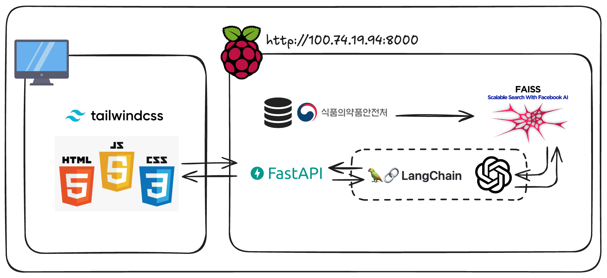

# AI 기반 맞춤형 식단 관리 및 추천 서비스

개인의 건강 목표와 식단 기록을 바탕으로 영양 정보를 분석하고, 맞춤형 음식 및 간식을 추천하는 웹 애플리케이션입니다.



## 🥗 프로젝트 소개: MY FLAVOURTIE

**MY FLAVOURTIE (마이 플레이버릿티)**는 사용자가 자신의 음식 취향을 기록하고 건강한 식단 관리를 할 수 있도록 돕는 개인 맞춤형 서비스입니다. 최근 서구화된 식습관과 건강에 대한 관심이 높아짐에 따라, 많은 사람들이 다이어트와 건강 관리에 어려움을 겪고 있습니다. 기존의 다이어트 앱들이 제공하는 획일적인 방식에서 벗어나, MY FLAVOURTIE는 사용자 개개인의 데이터를 기반으로 칼로리 소모량과 영양 균형을 고려한 음식을 추천합니다. 이를 통해 보다 지속 가능하고 즐거운 건강 관리 경험을 제공하는 것을 목표로 합니다.

### 배경 및 필요성

현대 사회는 음식이 점점 서구화되고, 트랜스지방과 같은 건강에 해로운 성분의 섭취가 늘고 있습니다. 이로 인해 대한민국 비만율은 1998년 26%에서 2023년 37%로 꾸준히 증가했으며, 복부비만, 고혈압, 고혈당 등 대사증후군 관련 건강 문제 또한 심각해지고 있습니다. 2022년 기준, 우리나라 성인의 약 70%가 대사증후군 위험요소를 하나 이상 보유하고 있으며, 이는 많은 사람들이 건강 관리에 대한 필요성을 느끼고 있음을 시사합니다.

### 기존 솔루션의 한계와 새로운 접근

시중에 많은 다이어트 앱이 존재하지만, 대부분 극단적인 식단을 요구하거나 획일적인 정보만을 제공하여 사용자 개개인의 특성을 반영하지 못하고 지속적인 동기부여에 실패하는 경우가 많습니다. 이러한 문제점을 해결하기 위해 MY FLAVOURTIE는 다음과 같은 새로운 접근 방식을 취합니다.

- **개인 맞춤형 추천:** 사용자의 식단 기록, 건강 목표, 심지어 음식 취향까지 고려하여 맞춤형 음식 및 간식을 추천합니다.
- **지속 가능한 건강 관리:** 극단적인 제한보다는 균형 잡힌 영양 섭취와 건강한 식습관 형성을 지원합니다.
- **사용자 중심 설계:** 쉽고 직관적인 인터페이스를 통해 누구나 편리하게 식단을 기록하고 관리할 수 있도록 합니다.

### 핵심 사용자 흐름

1.  **회원가입 및 기본 정보 등록:** 사용자의 건강 목표 설정 (체중, 기간, 활동량 등).
2.  **식단 기록:** 섭취한 음식을 직접 입력하거나 사진 업로드 (향후 AI 이미지 인식 기능 예정).
3.  **영양 정보 분석:** 기록된 식단을 바탕으로 섭취 칼로리 및 주요 영양소 자동 계산.
4.  **맞춤 음식/간식 추천:** 분석된 영양 정보와 남은 칼로리, 개인 특성을 종합적으로 고려하여 최적의 음식 추천.

## 🌟 주요 기능

- **🎯 목표 설정:** 사용자의 현재 체중, 목표 체중, 목표 달성 기간, 활동 수준을 입력받아 일일 권장 섭취 칼로리 및 영양소 목표를 설정합니다.
- **🥗 식단 기록:** 아침, 점심, 저녁, 간식으로 나누어 섭취한 음식 기록이 가능합니다.
    - 기록된 음식을 기반으로 섭취한 칼로리, 단백질, 지방, 탄수화물 등의 주요 영양소 정보를 자동으로 계산하여 보여줍니다.
- **📊 영양 분석 및 요약:**
    - 일일 총 섭취 영양소와 목표 영양소를 비교하여 시각적으로 제공합니다.
- **🔍 음식 검색:**
    - 키워드를 통해 음식 데이터베이스에서 음식을 검색할 수 있습니다.
    - 자연어 처리 및 벡터 검색을 활용하여 입력한 음식과 유사한 음식을 추천하고 영양 정보를 제공합니다.
- **🍪 맞춤 간식 추천:**
    - 사용자의 목표 칼로리, 현재까지 섭취한 칼로리를 고려하여 적절한 간식을 추천합니다.

## 🛠️ 기술 스택

### 백엔드 (Backend)

- **언어/프레임워크:** Python, FastAPI
- **데이터베이스:**
    - SQLite (사용자 목표, 식단 기록 등 관계형 데이터)
    - JSON (초기 음식 영양 정보 데이터베이스 - 식품의약품안전처 공공데이터 기반)
- **벡터 검색:**
    - Faiss (유사 음식 검색을 위한 인덱싱 및 검색)
    - SentenceTransformers (`jhgan/ko-sroberta-multitask` 모델, 한국어 문장 임베딩)
- **AI (향후 확장 고려):**
    - OpenAI Vision API 또는 자체 이미지 분류 모델 (식단 사진 분석용)
- **API 통신:** RESTful API
- **서버:** Uvicorn
- **배포 환경:** 라즈베리파이 (초기 MVP 및 개발 환경)

### 프론트엔드 (Frontend)

- **언어/프레임워크:** JavaScript, React
- **스타일링:** Tailwind CSS, CSS

### 기타

- **버전 관리:** Git, GitHub

## 🚀 설치 및 실행 방법

### 사전 준비

- Python (3.8 이상 권장) 및 pip
- Node.js (16.x 이상 권장) 및 npm 또는 yarn
- (필요시) Git LFS 설치

### 1. 백엔드 (Backend) 설정 및 실행

```bash
# 1. 프로젝트 클론 (이미 진행했다면 생략)
# git clone <repository_url>
# cd <project_directory>

# 2. 백엔드 디렉토리로 이동
cd backend

# 3. 가상환경 생성 및 활성화 (권장)
python -m venv venv
source venv/bin/activate  # macOS/Linux
# venv\\Scripts\\activate    # Windows

# 4. 필요한 라이브러리 설치
pip install -r requirements.txt  # requirements.txt 파일이 있다면. 없다면 주요 라이브러리 명시:
# pip install fastapi uvicorn sqlalchemy python-dotenv sentence-transformers faiss-cpu numpy

# 5. 환경 변수 설정 (필요한 경우)
# .env 파일을 backend 디렉토리에 생성하고 필요한 환경 변수(예: 데이터베이스 경로 등)를 설정합니다.

# 6. 백엔드 서버 실행
# food_db.json 파일이 backend/data/ 디렉토리에 있는지 확인하세요.
# 처음 실행 시 Faiss 인덱스 빌드 시간이 소요될 수 있습니다.
python -m uvicorn main:app --reload
```
기본적으로 `http://127.0.0.1:8000` 에서 실행됩니다.

### 2. 프론트엔드 (Frontend) 설정 및 실행

```bash
# 1. 프론트엔드 디렉토리로 이동 (프로젝트 루트에서)
cd frontend

# 2. 필요한 라이브러리 설치
npm install
# 또는 yarn install

# 3. 프론트엔드 개발 서버 실행
npm start
# 또는 yarn start
```
기본적으로 `http://localhost:3000` 에서 실행되며, 백엔드 API와 통신합니다.

## 📁 프로젝트 구조 (예시)

```
ad-project/ (루트 디렉토리)
├── backend/                  # 백엔드 FastAPI 애플리케이션
│   ├── data/                 # food_db.json, food_faiss.index 등 데이터 파일
│   ├── database/             # db.py (SQLAlchemy 설정)
│   ├── models/               # models.py (SQLAlchemy 모델 정의)
│   ├── services/             # calorie.py, recommender.py, vector_search.py 등 비즈니스 로직
│   ├── .env                  # (예시) 환경 변수 파일
│   ├── main.py               # FastAPI 애플리케이션 진입점
│   └── requirements.txt      # (예시) Python 의존성 파일
├── frontend/                 # 프론트엔드 React 애플리케이션
│   ├── public/               # 정적 파일 (index.html, assets 등)
│   ├── src/
│   │   ├── components/       # React 컴포넌트
│   │   ├── pages/            # (예시) 페이지 단위 컴포넌트
│   │   ├── services/api.js   # (예시) 백엔드 API 호출 함수
│   │   ├── App.js
│   │   └── index.js
│   ├── package.json
│   └── ...
├── assets/                   # 프로젝트 관련 공유 에셋 (아키텍처 다이어그램 등)
│   └── project_architecture.png
├── .git/
├── .gitignore
└── README.md                 # 현재 보고 있는 파일
```

## 📖 API 엔드포인트 (주요 항목)

- `POST /goal`: 사용자 목표 설정
- `POST /meal`: 식단 기록 업로드
- `DELETE /meal/{meal_id}`: 특정 식단 기록 삭제
- `GET /summary`: 일일 영양 섭취 요약 정보 조회
- `GET /foods/search?query={검색어}`: 음식 검색
- `GET /recommend/snacks`: 맞춤 간식 추천

## 💡 향후 개선 사항

- [ ] 사용자 인증 및 회원가입 기능
- [ ] 식단 사진 OCR을 통한 자동 음식 인식 및 기록 (OpenAI Vision API 또는 자체 모델 활용)
- [ ] 더 다양한 영양 정보 (비타민, 미네랄 등) 제공 및 분석 (KFDA, USDA 데이터베이스 추가 활용)
- [ ] 주간/월간 리포트 기능
- [ ] 데이터 시각화 개선
- [ ] 음식 데이터베이스 확장 및 정기적인 업데이트

---

이 README는 프로젝트 진행 상황에 따라 계속 업데이트될 수 있습니다.